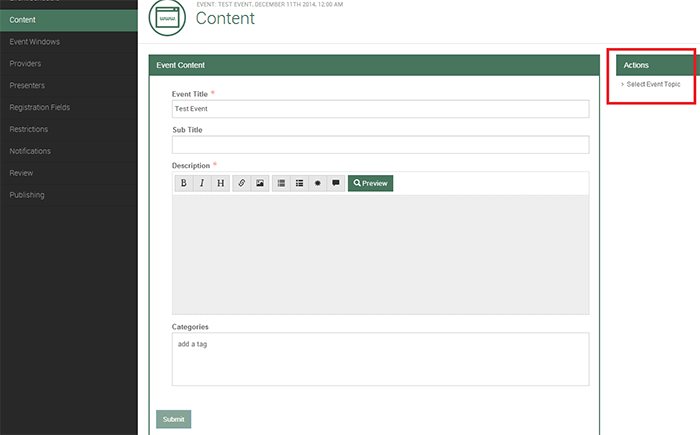

 # Events

The Event level is where you actual schedule the event. It’s during this step that you choose the capacity for the event, the event date and time, as well as a few other Event specific features.
 
 ### Start an Event Project 
 
 After you have created your Event Template, it’s now time to build and schedule your first Event Project. 
 
 From the Tenant Homepage select Start Event Project from the Actions section on the right.

After selecting Start Event Project, the following pop up window will appear.

n the Stakeholder box, enter in a valid Owner Number. The Project Name box is where you name the project; this is not the event title, but it will be auto populated into the event title field for project/title consistency.  There are no dependencies on an Event Project name verses an Event Title name.  It is strictly a matter of nomenclature preference.  Choose an Event Template. Then associate the Event with the Site that was created and uploaded for you. Finally, hit Submit.  

After clicking Submit, the work flow process will take you to the Event Schedule page. This is the page where you choose the date, time, time zone, duration, and capacity of your event. When you have finished click Submit.

### Event Content

The next section is Content. This is where you add the event title, a sub-title if desired, the event description, a topic, and any category tags. Keep in mind that the Event Title and Description are required.

When you are finished editing the Content section, press Submit.

The content can be formatted with a simple language called Markdown. Find out how to use it here:  [Markdown](http://markdowntutorial.com/) 	

### Event Windows

The next menu option is Event Windows. This section controls the registration and attendance windows. These options can be set and locked within the Template or you may edit them as you are setting up the event.

Click Submit when finished.

### Web Event Providers

iER supports a broad variety of web meeting providers.

### Providers (WebEx)

The most important note about Providers is that they must be declared within the Template initially. This means that if you forget to declare an audio and web provider in your Template, when you get to the Providers section of your event, you will have to stop. You can restart the process from the beginning after you have edited your Template.

To add a WebEx Event or Meeting Center provider, select the appropriate provider. Add the WebEx site, not the entire link, just the unique part of the link. For instance if your link is, https://intercallcenters.webex.com 

just add intercallcenters

The next step is to add your Meeting Number. 

#### IMPORTANT: 

Make sure there are no spaces in the meeting number, this is critical.


The only thing left to do is add your Conference ID and Toll and Toll Free numbers.

### Providers (Adobe)

To add an Adobe Connect provider, select Adobe Connect from the Provider dropdown first.
Add Account ID, Event ID, and the Adobe Connect Server URL. 

Adobe Connect Server is just the URL for the Adobe site. 

The Account ID can be located in the resolved URL for the Adobe site after you log in. 

The Event ID can be found at the very end of the Adobe Attendee URL, as seen below.


### Providers (IWS)

To add an IWS provider, select Intercall Webcast Studio (IWS) from the Provider dropdown first.

Add an Event ID and a VEC ID.

The Event ID can be found in IWS next to the event name, as seen below. 

The VEC ID can be found at the top of any page within the VEC.

### Providers (Live Meeting)

To add a Microsoft Live Meeting provider, select Microsoft Live Meeting from the Provider dropdown.

Add a Conference Center, Meeting ID, and a Meeting Password (if applicable).

Conference Center can be found at the end of the Live Meeting site URL.

Meeting ID and Meeting Password (Attendee Entry Code) can both be located on the Meeting Details page in Live Meeting.

### Presenters

The next section is called Presenters. If a Presenter is desired, click Add Presenter.

All fields are required when setting up a Presenter.

After you have finished, click Submit.

### Registration Fields

The next section is Registration Fields. Registration fields are set up the same way as in the Template itself.

To edit an existing registration field, highlight the desired field (red box above) and edit appropriately (blue box on right). 

You can copy a field by clicking on the green box with a grey cross in it. Keep in mind that if the field is locked in the Template, you will not be able to edit it at the event level.

To add a new field, select the Add Field tab from the box on the right.

After you have added a field, you will be taken back to the editor. From there you can label your question, mark it as required, and edit several other options.
 
When you are finished editing, click Back to Template from the menu options on the left.
 
Custom Event Fields are created exactly the same way as standard registration fields. Keep in mind that if you initially set up a Custom Event Field in you Template, you will be required to add it to your Event.

### Custom Fields

This is where you will add the Contact Info for the event. Keep in mind that this information will be distributed throughout the site, so you will want to format it however you prefer. 

### Prices

The prices tab will only appear if you have activated Ecommerce on the account. Start by clicking the Add Price button. 

On this page you can set an Amount, give a Description, and set Starts At and Ends At dates/times for the price range. Click Submit when finished. 

#### NOTE:
 
If you click on the Prices tab and you just get a “Loading” page, double-check to make sure you have added Ecommerce credentials to the Site. 

### Notifications

To add or edit email notifications, click on Notifications from the menu options on the left. To edit an existing notification, click the Notification Type on the left in blue. You can then select Update Notification on the right in purple. To add a new notification, click Add Notification on the right in red. If they are Notifications are locked in the Template, you will not be able to edit them at the event level.

Selecting Update Notification will bring up the Transactional Notification window shown below. 

You can disable notifications by clicking the green “Yes” under Enabled.

The Review option is a handy feature. It allows you to send a preliminary copy of the event to a Stakeholder or peer before publishing. 

Click Start a Review on the right as shown below.

A pop up window will appear titled Start a Review. The Review Instructions box can be used if you would like to include a message to your reviewer. 

Add a Reviewer Email

If you would like to send the Review to more than one person, press Enter on your keyboard to go to a new line, then add a new email address.

### Publishing

If you have any errors in the event, they will be displayed in the Validation Check section shown below. If there are no errors in the Event, you may choose to Publish Event to publish or Abandon Event to discard your event.

Once you have selected Publish Event, the following pop up window will be displayed. You may choose to Notify Stakeholder if you would like a message to go to the person associated with the Owner Number initially used to set up the event.

Event projects can be in multiple stages of completion and will always have a The Event level is where you actual schedule the event. It’s during this step that you choose the capacity for the event, the event date and time, as well as a few other Event specific features. 

### Event Details

Event Details is a summary of all the different information regarding your event. You can make changes to your event from here as well. 

Click the Events button at the top of your screen. You may then search for the title of your Event. You can also find the event in the Recently Selected Events section.

### Notifications

From the Notifications section you can check the status of the emails sent to your registrants. The included metrics are Sent (successfully sent emails) and Bounced (failed emails).

### Registrants

From the Registrants section you can browse the individuals who have registered for your event. 

You can also manually Add a Registrant.

Select the registrant’s Time zone, First and Last name, and Email. Then click Submit.

### History

Lastly, the History section lets you see details about the different changes that have been made to the Event.

### Add Recording Link

Once your event has been completed, you still to add the Recording Link for the follow up emails. After locating and clicking on your event in the Tenant site, from the Event Details tab click Set Recording Link, on the right side of your screen.

Choose whether or not you would like to Notify Registrants, add your Recording Link and any notes you may have. Then click Submit.

