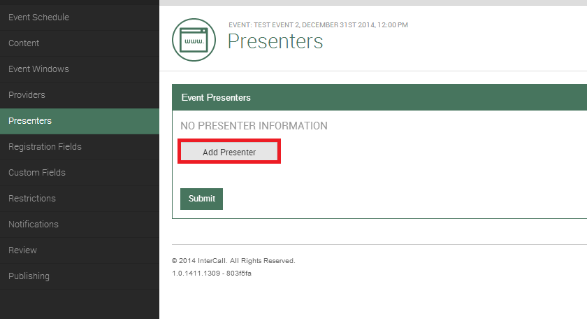
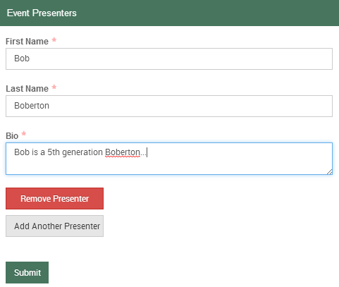

# Presenters

The next section is called Presenters. If a Presenter is desired, click Add Presenter.

The following required fields are available by default for simple Presenter set up:

After you have finished, click Submit.

IMPORTANT: Should you want more field data options like Phone Number and/or Email Address etc., then you will need to stop, abandon the event, and update the Presenter Fields in the Tenant Admin à Account Settings section.  
