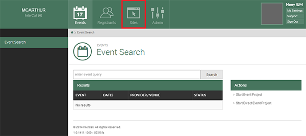

# Sites

**Please Note**: the information on this page is also available in screencast format at the following URL:

[Creating a Site](https://youtu.be/7PdzqX0ZDDk)

---

 Sites are used to set separate events and provide a custom look for those sites.

 An appropriate use case would be as follows:

 A high volume customer has multiple contacts, some of whom need to have the ability to separate their events. Some of them also need to include special information on the registration page that wouldn’t apply to other contacts. In this case, we would build that contact a site.

### Creating a Site

Once you are at your Tenant Admin Page, a Site will need to be created to display the events. You can create multiple sites if necessary.

During Event creation you have the option to associate the event with a Site.

To create a Site simply click on the Sites button from within the Tenant Homepage.  

After clicking Sites, you will be taken to the Site List page. Select Create Site from the right side of the page.

Once you click Create Site, the following pop up window will appear:

Site Host Name will be the prefix of the URL for your Site. Make sure there are no spaces between words or you will generate an error.

Site Title is the name that will be displayed on the Site itself.

Selecting a Timezone will cause all events in the Site to be displayed in the given time zone.

Once you click Submit you will be taken back to the Site List. This is where you can find the URL you just created as shown below:

This link will take you to an individual catalog page.

### Site Settings

If you would like to edit your newly created site, click on the Site Name from the Site List page. This takes you to the Site Settings Page:

From the Site Settings page, you can select multiple actions, disable the site, change the Site Hostname (URL prefix), or change the Site Settings (The name of the site or the Time Zone).

Selecting Theme Details allows you to edit and configure the Theme, Email Settings allows you to edit Reply-to Address as well as the Reply-to name.

Identity Settings is where you can configure many different options regarding how users login to iER. This is similar to Profile Scope in AMP in some respects.

Selecting Change Identity Settings has several options to choose from. Under Identity Requirement you have three options: Optional, Always Required, and Required Before Registration.

If you select Always Required, the users will have to login to their account before they see anything on the site. If you select Required Before Registration, the client will only have to login immediately before registering.

We won’t be addressing the other Identity settings in this guide as they pertain to Single Sign On. This feature is more of a Developer feature and will be addressed in the Developer’s Guide.
