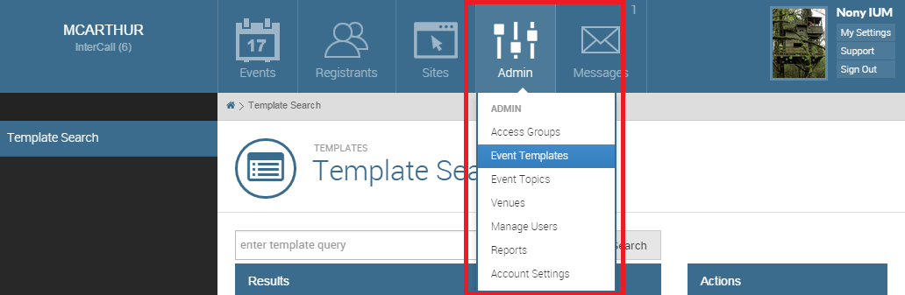

# Templates

Templates can be set up in a variety of ways. The purpose of a Template is to be able to set up the majority of your Event only one time.

In order to schedule events, you must first have a published Event Template. Nearly all of the functionality that is available within Events can set up within a Template.
Additionally, a majority of the settings can be locked down or made optional.

### Creating a Template

To create a new template, start at the Tenant Homepage and click the Admin button at the top of your screen. Then select Event Templates as shown below.


From the Template Search page select Create Event Template located on the right.

