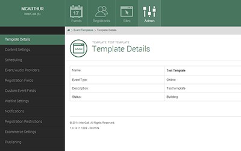
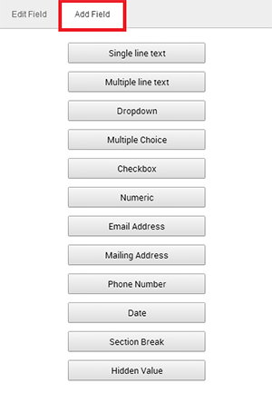

# Templates

`Please note`: most of the information on this page is also available in screencast format at the following URL:
[Creating a Template](http://youtu.be/nT31vyTaxM0)

---

Templates can be set up in a variety of ways. The purpose of a Template is to be able to set up the majority of your Event only one time.

In order to schedule events, you must first have a published Event Template. Nearly all of the functionality that is available within Events can set up within a Template.  Additionally, a majority of the settings can be locked down or made optional.

## Creating a Template

To create a new template, start at the Tenant Homepage and click the Admin button at the top of your screen. Then select Event Templates as shown below.
From the Template Search page select Create Event Template located on the right.

The following pop up window will be displayed.

Select the Event Type from the drop down menu, you can choose Online (anything event that requires a computer or telephone), Offline (Anything that requires a Venue, i.e. a live event without an online component), or On Demand (a previously recorded event or an immediate entry event).

Select a Template Name, add any Template Description you desire, and then click Submit.

After creating the initial Template, you will be dropped into the Template Details page. From this page you can customize your template in many ways.

## Event Scheduling

The Template can be customized via the Menu options on the left. The scheduling section is where you can set the Registration Window and the Attendance Window defaults. Simply choose one of the corresponding Actions on the right to complete your task.

The following screen shots show your options upon clicking either Action.

`IMPORTANT!` The Event/Audio Providers section is where you would create Meeting Providers for your Template. This is a key step because there is no way to set up a provider within an Event.

## Event/Audio Providers

Select "Set Event Providers" to choose which Providers you will allow on your event.

After clicking "Set Event Providers", the following pop up will be displayed.

Select the appropriate Meeting and Audio Providers and click Submit.

## Registration Fields

The Registration Fields section is where you can customize individual registration fields. Click "Setup Registration Fields."

Similar to all other registration platforms we work with, you can add or subtract registration fields. Once clicking on "Setup Registration Fields," you will be taken to the Registration Fields Editor.

Existing registration fields are displayed on the left while the Edit and Add options are displayed on the right.

To edit an existing registration field, highlight the desired field (red box above) and edit appropriately (blue box on right).

You can copy a field by simply clicking on the green box with a gray cross in it. To add a new field, select the Add Field tab from the box on the right.

After you have selected a new registration question type, you will be taken back to the editor. From there you can label your question, mark it as required, and edit several other options.

When you are finished editing, click Back to Template from the menu options on the left.

## Waitlisting

The next tab is Waitlist Settings. After you have clicked on the tab, select Set Waitlist Settings on the right under Actions.

Then toggle the button under Settings Available. It will turn to green as shown below.

Once you have turned the settings on, you can select a mode. You have three options: No waitlist, Waitlist enabled, Stakeholder screening.

Selecting No Waitlist will leave Waitlisting disabled. Waitlist Enabled activates Waitlisting on the template. Stakeholder Screening turns on screening in the platform.

Waitlisting is tied to the Capacity of the event. If the event is at capacity, and Waitlisting is enabled, people can add themselves to the Waitlist as opposed to registering. The process is exactly the same. Instead of receiving a confirmation email, they will receive an email letting them know that they have been added to the Waitlist.

To allow Waitlisted registrants into the event, after you have published the event, go to the Event Details. Once you are there, select Waiting List.

Then click on the name of the registrant, this will take you to the Registrant Details page. Select Promote From Waitlist from the actions section.

The following popup will appear:

Click Submit to finish adding the registrant.
Waitlist must be enabled at the event level from the Event Schedule Window as well.

To use Stakeholder Screening, select the option from the Waitlist menu shown above. This will add every registrant to the Waitlist automatically. Each registrant will have to be approved using the same method as shown in the Waitlist instructions above.

## Notifications

To add or edit email notifications, click on Notifications from the menu options on the left.

To add a new notification, click Add Notification on the right in red.

To edit an existing notification, click the Notification Type in blue. You can then select Update Notification on the right in purple.


Selecting Add Notification will bring up the Add Scheduled Notification window, shown below.

The content can be formatted with a simple language called Markdown. Find out how to use it here:  [Markdown](http://markdowntutorial.com/)


Selecting Update Notification will bring up the Transactional Notification window shown below.

Both adding and editing notifications allows you to set the timing of the notification and make aesthetic and formatting changes.

## Registration Restrictions

The next section is the Registration Restrictions tab. From this page, click on Set Registration Restrictions from the actions tab on the right.

After clicking the Set Registration Restrictions button, the following pop-up will appear.

From this page you can change the Visibility, Allow Guest Registration with a Guest Limit, or you can Enable Access Groups.

Changing the Visibility of an event from Public to Private, basically means that the event goes from being listed on the Site’s Catalog page to being available only by direct link.

Allowing Guest Registration makes it possible for people to register more registrants than just themselves. For instance, if the Guest Registration limit was set at 3 registrations, in addition to themselves, the registrant could also register 3 other people. The same registration questions that the registrant has to fill out for themselves will need to be filled out for their guests as well.

## Ecommerce Settings

The final section before publishing is Ecommerce Settings. It’s here that Ecommerce can be activated. Before doing this, you need to make sure that the Global Ecommerce credentials have been added to the site.

Click on the Admin icon at the top of your screen. Then click Account Settings.

Select the Ecommerce Settings tab on the left of your screen to add credentials. The only Payment Processor that iER uses is Authorize.net. You will need a Merchant Login and a Merchant Key.

To activate ecommerce at the event level, click on Set Ecommerce Settings.

The following window pop-up will appear:

Just toggle the button underneath Ecommerce Enabled to turn ecommerce on for your event.

## Publishing

Finally, after making any adjustments to the Template, you must publish it so that it can be used to create and guide the individual event creation process.

Select Publish Event Template to publish or Abandon Event Template if you plan on deleting your work.

Keep in mind that after you publish your Template, in order to make edits you will need to Unpublish it first. The Unpublish feature can be found in the Publishing section of the Template Editor. It appears after you have initially published your Template.
