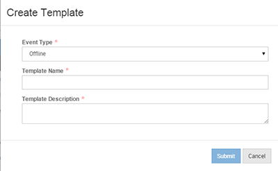

# Venues

Setting up Venues is a little more involved then setting up a standard event. You need two things before you get started: a Global Venue and an Offline Template. Without these two items, you won’t be able to proceed.

The first thing you need to do is to create a Global Venue. Once you have logged into your Tenant account, click on the Admin icon at the top of your screen. Then click Venues.

The next step is to select Create Venue from the Actions section on the right.

After selected Create Venue you will need to create add in the location information.

After adding the location information, you can edit the exact location via Bing Maps.

If the location is correct, click the Set Map Coordinates link under the Actions tab on the right. After setting the correct coordinates, go to the Publishing tab and select Publish Venue.

NOTE: If you would like to add Venue properties, you can do this at the Global level. Select the Admin icon at the top of the screen. Then select Account Settings. Click on the Venue Properties tab on the left. These properties can be set back in the Venues section after clicking on Admin at the top of your screen. Or they can be set in the Template.

Now you need to make sure that you have an Offline Template created. Go back to the Template section if you need to refresh on how to create a Template. The only difference is that you need to select Offline as the event type.

To add a Venue to the event, you must first make sure that you select the appropriate Offline template when creating your event. Then select the Venue tab. Add the Venue by clicking on Select Venue under the Action section on the right side of your screen.

Type in the name of your newly created Venue and click Submit.

